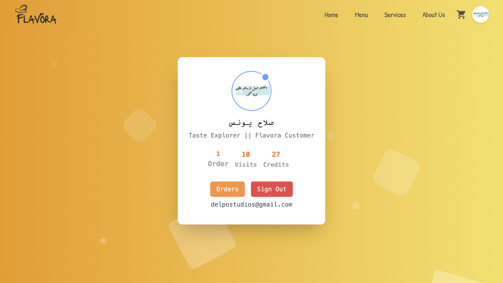
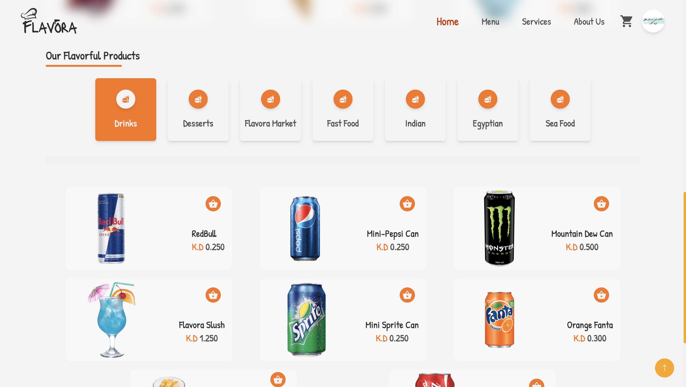
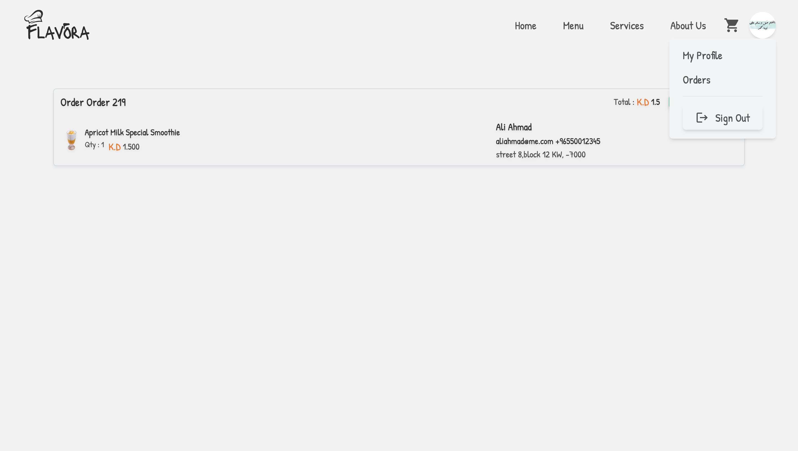
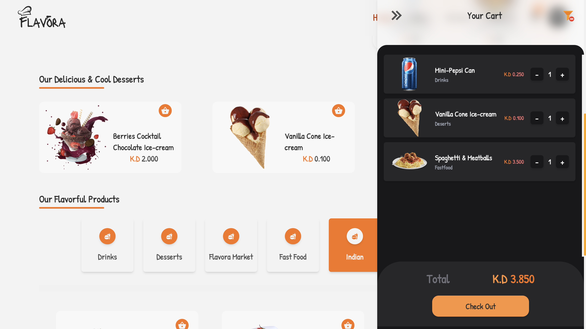
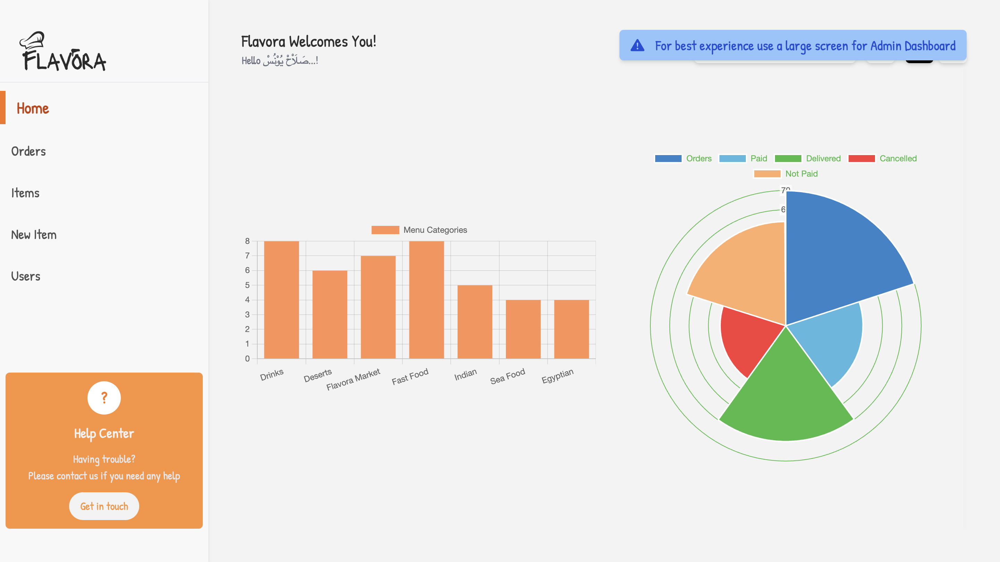
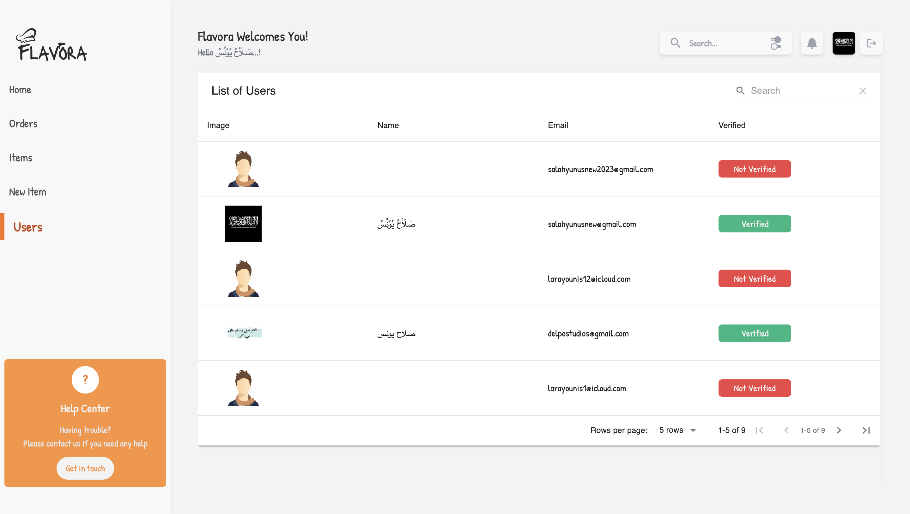
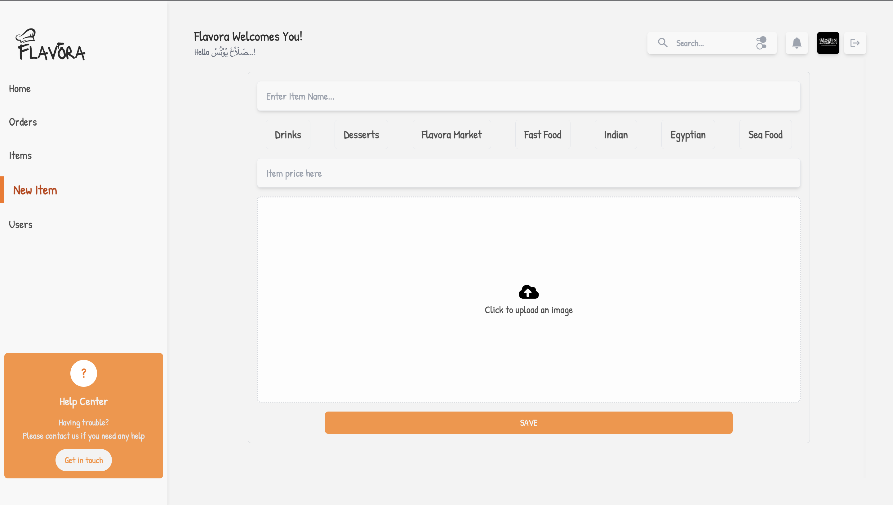
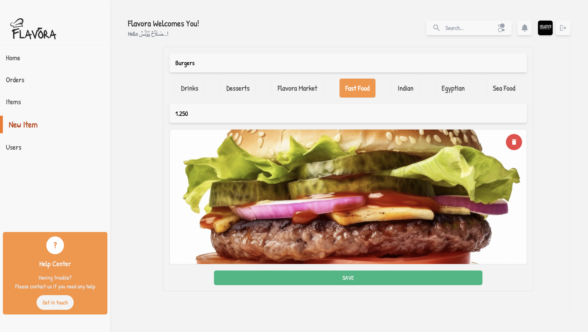
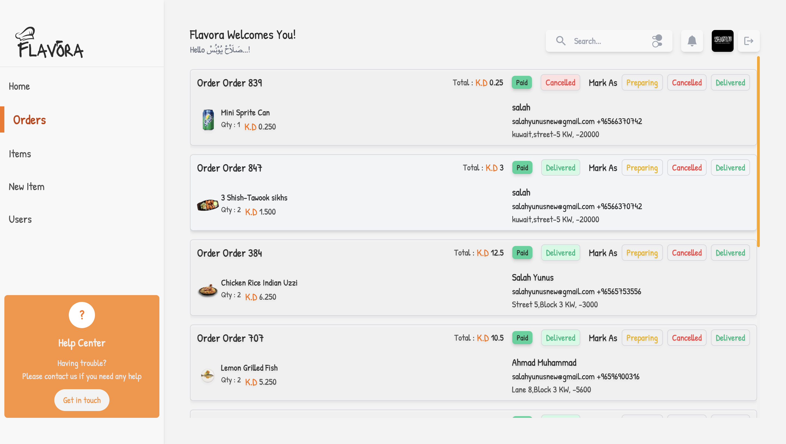

# Flavora

> Welcome to Flavora!
> Where Taste Takes Center Stage


## Table of Contents

- [Overview](#overview)
- [Features](#features)
- [Installation](#installation)
- [Technologies Used](#technologies-used)
- [Contributing](#contributing)
- [License](#license)
- [Contact](#contact)
- [Screenshots](#screens)
- [File Structure](#file-structure)
  - [FLAVORA](#flavora)
    - [Client Folder](#client-folder)
      - [Public Folder](#public-folder)
      - [Src Folder](#src-folder)
    - [Server Folder](#server-folder)
      - [functions](#contents)
        - [routes](#contents)

## Overview

Flavora is a state-of-flavour restaurant website developed using React, Redux, React Router, and integrated with Stripe for secure payment processing. It boasts an extensive range of products, from hot dishes to cool desserts, and everything in between. Elevate your backend + frontend experience with this wonderful example project.

## Features

- Detailed comments explaining.
- Admin Dashboard
- Admin Authentication
- CRUD functions
- Server-Side, Client-Side rendering
- Firestore DB, Firebase Authentication, Firebase Admin systems on server & client side
- FullStack functional Cart
- Secure payments powered by Stripe, with refunds, shipping, cancel system, and more...
- User Profiles with stats
- Track Orders as User, manage orders as Admin
- Fluent state management using Redux.
- Awesome animations & transitions with framer-motion
- Completely Responsive design
- Custom Popups, custom alerts, context menu, select color, loader, scrollbars and other cool options
- Next Level forms validation and email verification
- Admin track users, order status, items...
- Responsive Carousels, Redirectors, Filters...

## Installation

1. Clone the repository:

```bash
git clone https://github.com/salahyunus/tijara.git
```

2. Navigate to the project directory:

```bash
cd Flavora
```

3. Ibstall Dependencies

```bash
yarn install
```

4. Create a .env file in the root directory and add your Stripe API key, Admin User ID (key), Firebase Config

```dotenv
REACT_APP_STRIPE_API_KEY=your_stripe_api_key
```

Finally:

```bash
yarn start
```

## Technologies Used

- Core:
- [](https://skillicons.dev)
- Backend:

- [](https://skillicons.dev)

- Navigation:
- 
- Payment:
- 
- Styling:
- [](https://skillicons.dev)

## Contributing

I heartily welcome contributions from the community! To contribute to Flavora:

1. Fork the repository.
2. Create a new branch for your feature or bug fix:
   > `git checkout -b feature-name`
3. Make your changes and commit:
   > `git commit -m "Add feature"`
4. Push to your branch:
   > `git push origin feature-name`
5. reate a pull request detailing your changes.

## License

This project is licensed under the MIT License.

## Contact

For any inquiries or assistance, please reach out to me at salahyunusnew@gmail.com

## SCREENSHOTS













## File Structure

### FLAVORA

`Main Folder` containing `client` & `server` folders

### Client Folder

The `client` folder contains the frontend code of the project. It includes:

- `.env`: Environment variables (ignored by `.gitignore`).
- `tailwind.config.js`: Configuration for Tailwind CSS.

### src Folder

- `index.js`: Entry point for the app.
- `index.css`: Main stylesheet for the app.
- `app.js`: Root component that sets up the app's structure.

Subfolders within `src`:

- `animations`: Reusable animation components.
- `api`: API request functions (using Axios) for user, cart, and product data.
- `assets`: Various assets like CSS, icons, and images.
- `components`: Reusable components like alerts, tables, inputs, etc.
- > `components that start with DB means its a dashboard component`
- `config`: Firebase configuration (using `.env` for sensitive data).
- `containers`: Main components/pages such as login, dashboard, etc.
- `context`: Redux actions and reducers (user, product, alert, etc).
- `utils`: Shared utility functions and styles like `product categories`.

### Public Folder

The `public` folder contains:

- `index.html`: Entry point for the app.
- Favicon and OG images (for SEO).

## Server Folder

The `server` folder contains the backend functionality of the project, implemented using Firebase. This folder manages API endpoints, routes, and other server-related operations.

### Contents

- `functions` Folder: This subfolder houses the Firebase Cloud Functions that handle server-side logic.

  - `routes` Folder: Contains route handlers for different API endpoints.
    - `user.js`: Manages user-related API endpoints.
    - `products.js`: Handles product-related API endpoints.

- `.env`: Environment variables used for server configuration (ignored by `.gitignore`).
- `serviceAccountKey.json`: Firebase Admin SDK key for secure server-side operations (ignored by `.gitignore`).
- `index.js`: Entry point for the server, sets up CORS (Cross-Origin Resource Sharing), API endpoints, and body parser for JSON data.

### Firebase Functionality

- The `function` folder contains Firebase Cloud Functions that allow you to execute server-side logic. These functions can be triggered by HTTP requests or other events, and they manage API endpoints and handle business logic.

- The `routes` subfolder organizes API endpoints by their purpose, with separate files for different functionalities. For example, `user.js` might handle user authentication and registration, while `products.js` manages operations related to products.

- The `.env` file stores environment variables for server configuration. These variables can hold sensitive information like API keys or database credentials and are excluded from version control for security reasons.

- The `serviceAccountKey.json` file contains the Firebase Admin SDK key, used to securely interact with Firebase services. This file is also kept out of version control to prevent exposing sensitive data.

- `index.js` serves as the entry point for the server. It sets up CORS to handle cross-origin requests, establishes API endpoints using the route handlers, and includes middleware like the body parser for parsing JSON data from requests.

> This server architecture ensures that frontend interacts with the backend seamlessly, enabling data processing, authentication, and other backend functionalities and also ensuring secutity rules are all met. Thanks to firebase cloud functions for this.
